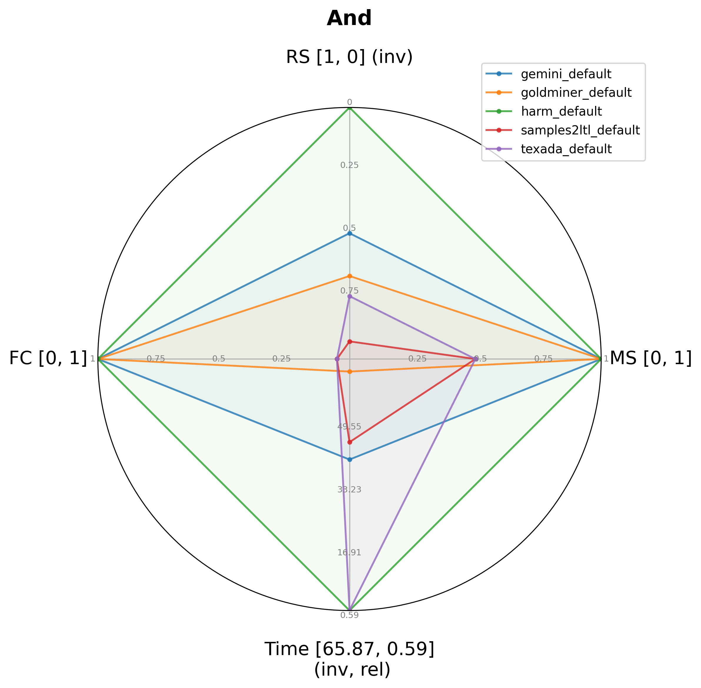

# The official repository of the Universal Specification Miner Tester (USM-T) tool


## Table of contents

[Project info](#project-info)

[Quick start](#quick-start)
1. [Install dependencies](#dependencies)
2. [Build the project](#build-the-project)
3. [Run the example](#run-the-example)

[How to use the tool](#how-to-use-the-tool)

[The configuration file](#the-configuration-file)

[Generating synthetic benchmarks](#generating-synthetic-benchmarks)

[Optional arguments](#optional-arguments)

[Citations](#citations)

## Project info

This project introduces a robust framework designed for evaluating and comparing LTL (Linear Temporal Logic) specification miners. Traditional approaches often struggle with subjective assessments and intricate configurations; our solution addresses these issues by offering a structured methodology to assess the quality of specifications through both semantic and syntactic analyses.


## Quick start

Currently, we support only Linux with gcc and clang (C++17) and cmake 3.14+.

### Dependencies
* Install uuid-dev and pkg-config

```
sudo apt-get install -y uuid-dev pkg-config
```
* Enter the tool directory

```
cd tool
```

* Install all third party dependencies. These will be compiled from source but will not affect your system, as all dependencies are installed in the third_party directory.

```
cd third_party
bash install_all.sh
```

The script will install the following dependencies:
* [spotLTL](https://spot.lrde.epita.fr/install.html)
* [antlr4-runtime](https://www.antlr.org)
* [gedlib](https://dbblumenthal.github.io/gedlib/)
* [z3](https://github.com/Z3Prover/z3.git)
* [spot](https://github.com/Z3Prover/z3.git)
* [boost](https://archives.boost.io/release/1.83.0/source/boost_1_83_0.tar.gz)


### Install [Docker](https://docs.docker.com/engine/install/ubuntu/)

## Build the project

Create a build directory inside the tool directory

```
cd tool
mkdir build && cd build
```

Configure the build environment with cmake.

```
cmake -DCMAKE_BUILD_TYPE=Release ..
```

Compile the project:

```
make
```

## How to use the tool

#### Set the environment variables for the tool

The next command must be run from the root of the repository.

```
bash scripts/setupEnvironment.sh
```

This will set the variable USMT_ROOT to the root of this repo.

#### Download the containerized miners

```
bash scripts/downloadMiners.sh
```

#### Go to the build directory

```
cd tool/build
```

#### Run the sample example

```
./usm-t --test ../../tests/arb2.xml --dump-to .
```

This will generate singolar reports in the runs directory for each miner and a summary report in the current directory. Together with a radar chart. We report an example of the radar chart generated below. 



## All Options

Below is a description of all supported command-line options:

- `--test <FILE>`  
  Specifies the input `.xml` file containing the USM-T test suite to execute.

- `--continue-on-error`  
  Continues execution even if one of the miners fails or cannot produce assertions. Without this option, execution stops at the first miner failure.

- `--dump-to <DIRECTORY>`  
  Dumps a summary report of the execution into the specified directory.

- `--ltlf`  
  Enables evaluation of specifications using **finite-trace semantics (LTLf)**. Disabled by default.

- `--sva`  
  Outputs mined specifications in **SystemVerilog Assertions (SVA)** format.

- `--psl`  
  Outputs mined specifications in **PSL (Property Specification Language)** format.

- `--spotltl`  
  Outputs mined specifications in **spotLTL** format, compatible with the Spot model checking library.

- `--silent`  
  Disables **all output**, including logs, warnings, and progress bars.

- `--wsilent`  
  Disables **warnings only**, while still showing errors and info messages.

- `--isilent`  
  Disables **informational messages**, but warnings and errors are still displayed.

- `--psilent`  
  Disables **progress bar output** during execution.

- `--help`  
  Displays the list of available options and exits.


## Manual
For a detailed manual on how to add a new test or miner check the manual MANUAL.md

## Mining challenges
We provide a set of mining challenges to evaluate the performance of LTL miners. See tool/synthetic_gen/README.md

## Citations

If you need to reference this tool in an academic publication, please use the following citation (add details here):

```

@INPROCEEDINGS{A_Baseline_Framework_for_the_Qualification_of_LTL_Specification_Miners2025,
  author={Germiniani, Samuele and Nicoletti, Daniele and Pravadelli, Graziano},
  booktitle={2025 Design, Automation & Test in Europe Conference (DATE)}, 
  title={A Baseline Framework for the Qualification of LTL Specification Miners}, 
  year={2025},
  volume={},
  number={},
  pages={1-7},
  keywords={Measurement;Semantics;Europe;Manuals;Syntactics;Containers;Benchmark testing;Logic;Reliability;Qualifications;Linear Temporal Logic;Specification Mining;SVA Generation;Assertion Mining;Behavior Detection},
  doi={10.23919/DATE64628.2025.10992993}}

```

